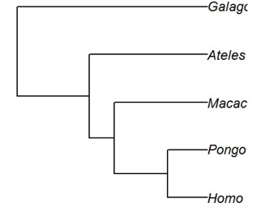

```{r setup, include=FALSE}
knitr::opts_chunk$set(echo = TRUE)
```

The <code>ape</code> and <code>phytools</code> packages in R contain tools for phylogenetic comparative methods. For more details on the <code>ape</code> package see the online book by E. Paradis, <i>Analysis of phylogenetics and evolution with R</i>. A link to this book can be found on the "textbooks" tab of the course main web pages.

Load the packages to begin. You will also need to load the <code>nlme</code> library later.

```{r eval = FALSE}
library(ape)
library(phytools)
```

***

## Phylogenetic trees
This section explains commands to read and write files containing phylogenetic trees, and to display trees in the plot window in R.

<br>

### Read tree from file
Phylogenetic trees are usually represented in one of two text formats, newick and nexus. The formats are explained below. To read a tree contained in a text file, use the corresponding command.

```{r eval = FALSE}
mytree <- read.tree(file.choose())   # newick format
mytree <- read.nexus(file.choose())  # nexus format
```

The object <code>mytree</code> is a special type of list. The following commands access some of the information stored in <code>mytree</code>.

```{r eval = FALSE}
mytree               # prints basic tree information
mytree$tip.label     # species names
mytree$edge.length   # lengths of all tree branches
mytree$edge          # identity of branches (from node, to node)
```

<br>

### Plot tree
Use the plot command to view a phylogeny stored in the object <code>mytree</code>. Include the <code>cex</code> option to help reduce overlap of species labels.

```{r eval = FALSE}
plot(mytree, cex=0.7)
```

<br>

### Write trees to file

```{r eval = FALSE}
write.tree(file.choose())   # newick format
write.nexus(file.choose())  # nexus format
```

<br>

### Tree formats
The newick format is used by most programs that estimate phylogenies. Trees in this format look like the following (you might need to scroll right within the box to see the entire line):

```{r eval = FALSE}
((((Homo:0.21,Pongo:0.21):0.28,Macaca:0.49):0.13,Ateles:0.62):0.38,Galago:1.00);
```

Each species at the tips of the phylogeny has a name followed by a number indicating the length of the branch connecting it to its immediate ancestor. Sister taxa -- those sharing an immediate common ancestor -- are wrapped by parentheses. In the above example, the innermost parentheses indicate that <i>Homo</i> and <i">Pongo are sister taxa. The next set of parentheses outward indicate that <i>Macaca</i> is the sister to the <i>Homo</i>/<i>Pongo</i> group. And so on. </i">

The nexus format is also widely used. The same tree shown above in newick format looks like the following in nexus format:

```{r eval = FALSE}
BEGIN TAXA;
DIMENSIONS NTAX = 5;
TAXLABELS
Homo
Pongo
Macaca
Ateles
Galago
;
END;
BEGIN TREES;
TRANSLATE
1       Homo,
2       Pongo,
3       Macaca,
4       Ateles,
5       Galago
;
TREE * UNTITLED = [&R] ((((1:0.21,2:0.21):0.28,3:0.49):0.13,4:0.62):0.38,5:1);
END;
```

***

## Trait data
Trait data read from a text file should be stored in a data frame. Use the familiar commands in R to read the data, e.g.,

```{r eval = FALSE}
mydata <- read.csv(file.choose(), stringsAsFactors=FALSE)
```

<br>

### Species names
Make sure the species names are included in the data frame. They should match to the letter (and case) the species names in the <code>mytree</code> object that stores the tree information (the species names are in mytree$tip.label). So be sure to check carefully.

<br>

### Row names
Some functions require that the row names of <code>mydata</code> be the species names. If the species names are contained in the variable <code>species</code> in <code>mydata</code>, set the rownames as follows

```{r eval = FALSE}
rownames(mydata) <- mydata$species
```

<br>

### Row order
The species data in the data frame containing the trait measurements must be in the <i>same row order</i> as the names of the species in the tree object, <code>mytree</code> (species names are in <code>mytree$tip.label</code>). If this is not the case then you need to rearrange the rows of the data frame to match the order of species names in the tree object. The following command will do this for you; it assumes that the rownames of <code>mydata</code> are the species names:

```{r eval = FALSE}
mydata <- mydata[match(mytree$tip.label,rownames(mydata)),]
```

<br>

### Plot continuous traits on trees
Values for a continuously-varying trait can be visualized at the tips of the tree using dots of varying size. A larger dot indicates a larger value for the trait. To begin, create a new data frame that contains <it>only</it> the numeric variables of interest (here, named <code>x</code>, <code>y</code>, and <code>z</code>).

```{r eval = FALSE}
mydat2 <- mydata[, c("x", "y", "z")]
dotTree(mytree, as.matrix(mydat2)[,c("x")]) # plot trait "x" at tree tips
```

<br>

### Phylogenetic signal
Phylogenetic signal is the tendency for closely related species to be more similar than distantly related species. Phylogenetic signal in a continuously varying trait can be quantified using Pagel's <i>λ</i> ("lambda"). This quantity ranges between 0 and 1, with 1 representing maximum phylogenetic signal. To begin, create a new data frame that contains <it>only</it> the numeric variables of interest (here, named <code>x</code>, <code>y</code>, and <code>z</code>).

```{r eval = FALSE}
mydat2 <- mydata[, c("x", "y", "z")]
phylosig(mytree, as.matrix(mydat2)[,c("x")]) # phylogenetic signal in trait "x"
```

***

##  Independent contrasts
This is a method that estimates and tests a regression or correlation between two variables while correcting for the nonindependence of data points resulting from phylogeny. It assumes that trait evolution mimics a Brownian motion process with unchanging rates through time and along all branches of the tree. This is a difficult assumption to verify.

Before beginning, make sure that the rows of the species data in <code>mydata</code> are in the same order as the names of the species in the tree object, <code>mytree</code>, namely <code>mytree$tip.label</code>. If not, see the previous section to rearrange.

<br>

### PICs
The method transforms the two variables x and y separately into phylogenetically independent contrasts (PICs), x1 and y1.  Then fit a linear model using these contrasts but <b>leave out the intercept term</b> so that the fitted line passes through the origin. The regression is though the origin because each contrast is calculated as a difference (e.g., species A minus species B) and the direction of the difference is arbitrary (it could just as well have been calculated as species B minus species A).

```{r eval = FALSE}
x1 <- pic(mydata$x, mytree)
y1 <- pic(mydata$y, mytree)
```

View <code>x1</code> and <code>y1</code> before entering the next command. Check especially for values listed as "NaN" or "Inf". They may result if some of the tip branches in the tree have length 0 (the branch lengths are given in <code>mytree$edge.length</code>). See below for suggestions on what to do in this case.

If all is well, then fit the linear model through the origin. All the usual commands can be used to pull results from the fitted <code>lm</code>  object, <code>z</code>.

```{r eval = FALSE}
z <- lm(y1 ~ x1 - 1)    # the "-1" forces line through origin
```

<br>

### Correlation
Often the goal is to estimate a correlation coefficient rather than a regression coefficient. The method for calculating a correlation between independent contrasts differs from the usual calculation for a correlation because we need to account for the fact that the direction of the contrast is arbitrary.  Both the following calculations should give the same answer. First calculate <code>x1</code>, <code>y1</code>, and <code>z</code> as in the PICs section above. Then calculate the correlation between independent contrasts as

```{r eval = FALSE}
r <- sum(x1*y1)/(sqrt(sum(x1^2))*sqrt(sum(y1^2)))  # or
r <- sqrt(summary(z)$r.squared)
```

<br>

### Zero branch lengths
The PIC method in <code>ape</code> will crash if certain of the branches of the tree have length zero. If this happens to you, inspect the branch lengths.

```{r eval = FALSE}
mytree$edge.length        # lengths of all tree branches
range(mytree$edge.length) # shortest and longest branch
```

Try adding a very small number to each of the branches to prevent crashes caused by zero branch lengths. Here I add a constant "0.001" to each branch.

```{r eval = FALSE}
mytree$edge.length <-  mytree$edge.length + 0.001
```

Retry the PICs method to see if this fixes the problem.

***

## General least squares method
General least squares (GLS) is a linear model technique that allows non-independent data points to be fitted when the expected similarity ("correlation") between data points is known. In the present case, phylogeny provides the expected correlations, assuming that trait evolution conforms to a Brownian motion process. The basic method gives identical results to PICs. The advantage of analyzing the data using GLS instead of PICs is that it provides a more flexible framework for analyzing trait evolution.

<br>

### Phylogenetic correlation matrix
GLS uses a matrix containing the expected correlations between the trait values of all pairs of species. The expected correlation between any pair is the proportion of evolutionary history, from root to tips, that they share through common descent. The phylogenetic correlation matrix is used to weight the data from each species in a linear model. You can view the matrix corresponding to a given phylogenetic tree using the following command:

```{r eval = FALSE}
vcv.phylo(mytree, cor=TRUE)
```

Here is the phylogenetic correlation matrix corresponding to the example tree above. The diagonal elements of the correlation matrix are "1". The off-diagonal elements give the fraction of the total tree, from root to tip, that is shared between a given pair of species <i>i</i> and <i>j</i>. For example, <i>Homo</i> and <i>Pongo</i> share a great deal of their histories (<i>ρ</i> = 0.79), prior to branching apart. At the other extreme, <i>Galago</i> shares none of its history with any other species in this tree (<i>ρ</i> = 0).
<table style="border: medium none ; border-collapse: collapse; width: 480px; height: 174px;" class="MsoTableGrid" border="0" cellpadding="0" cellspacing="0">
<tbody>
<tr style="">
<td style="border: 1pt solid black; padding: 0cm 5.4pt; width: 68.4pt;" valign="top" width="91">
<p class="MsoNormal" style="line-height: 150%;"><span style=""> </span><o:p></o:p></p>
</td>
<td style="border-style: solid solid solid none; border-color: black black black -moz-use-text-color; border-width: 1pt 1pt 1pt medium; padding: 0cm 5.4pt; width: 68.4pt; font-weight: bold; font-style: italic;" valign="top" width="91">
<p class="MsoNormal" style="line-height: 150%;"><span style="">  </span><span style=""> </span><span style=""> </span>Homo <o:p></o:p></p>
</td>
<td style="border-style: solid solid solid none; border-color: black black black -moz-use-text-color; border-width: 1pt 1pt 1pt medium; padding: 0cm 5.4pt; width: 68.4pt; font-weight: bold; font-style: italic;" valign="top" width="91">
<p class="MsoNormal" style="line-height: 150%;">Pongo <o:p></o:p></p>
</td>
<td style="border-style: solid solid solid none; border-color: black black black -moz-use-text-color; border-width: 1pt 1pt 1pt medium; padding: 0cm 5.4pt; width: 68.4pt; font-weight: bold; font-style: italic;" valign="top" width="91">
<p class="MsoNormal" style="line-height: 150%;">Macaca <o:p></o:p></p>
</td>
<td style="border-style: solid solid solid none; border-color: black black black -moz-use-text-color; border-width: 1pt 1pt 1pt medium; padding: 0cm 5.4pt; width: 68.4pt; font-weight: bold; font-style: italic;" valign="top" width="91">
<p class="MsoNormal" style="line-height: 150%;">Ateles <o:p></o:p></p>
</td>
<td style="border-style: solid solid solid none; border-color: black black black -moz-use-text-color; border-width: 1pt 1pt 1pt medium; padding: 0cm 5.4pt; width: 68.4pt; font-weight: bold; font-style: italic;" valign="top" width="91">
<p class="MsoNormal" style="line-height: 150%;">Galago<o:p></o:p></p>
</td>
</tr>
<tr style="">
<td style="border-style: none solid solid; border-color: -moz-use-text-color black black; border-width: medium 1pt 1pt; padding: 0cm 5.4pt; width: 68.4pt; font-weight: bold; font-style: italic;" valign="top" width="91">
<p class="MsoNormal" style="line-height: 150%;">Homo <o:p></o:p></p>
</td>
<td style="border-style: none solid solid none; border-color: -moz-use-text-color black black -moz-use-text-color; border-width: medium 1pt 1pt medium; padding: 0cm 5.4pt; width: 68.4pt; text-align: center;" valign="top" width="91">
<p class="MsoNormal" style="line-height: 150%;"><span style=""> </span><span style=""> </span>1 <o:p></o:p></p>
</td>
<td style="border-style: none solid solid none; border-color: -moz-use-text-color black black -moz-use-text-color; border-width: medium 1pt 1pt medium; padding: 0cm 5.4pt; width: 68.4pt; text-align: center;" valign="top" width="91">
<p class="MsoNormal" style="line-height: 150%;"><span style=""> </span>0.79 <o:p></o:p></p>
</td>
<td style="border-style: none solid solid none; border-color: -moz-use-text-color black black -moz-use-text-color; border-width: medium 1pt 1pt medium; padding: 0cm 5.4pt; width: 68.4pt; text-align: center;" valign="top" width="91">
<p class="MsoNormal" style="line-height: 150%;"><span style=""> </span><span style=""> </span>0.51 <o:p></o:p></p>
</td>
<td style="border-style: none solid solid none; border-color: -moz-use-text-color black black -moz-use-text-color; border-width: medium 1pt 1pt medium; padding: 0cm 5.4pt; width: 68.4pt; text-align: center;" valign="top" width="91">
<p class="MsoNormal" style="line-height: 150%;"><span style=""> </span><span style=""> </span>0.38 <o:p></o:p></p>
</td>
<td style="border-style: none solid solid none; border-color: -moz-use-text-color black black -moz-use-text-color; border-width: medium 1pt 1pt medium; padding: 0cm 5.4pt; width: 68.4pt; text-align: center;" valign="top" width="91">
<p class="MsoNormal" style="line-height: 150%;"><span style=""> </span><span style=""></span>0<o:p></o:p></p>
</td>
</tr>
<tr style="">
<td style="border-style: none solid solid; border-color: -moz-use-text-color black black; border-width: medium 1pt 1pt; padding: 0cm 5.4pt; width: 68.4pt; font-weight: bold; font-style: italic;" valign="top" width="91">
<p class="MsoNormal" style="line-height: 150%;">Pongo <o:p></o:p></p>
</td>
<td style="border-style: none solid solid none; border-color: -moz-use-text-color black black -moz-use-text-color; border-width: medium 1pt 1pt medium; padding: 0cm 5.4pt; width: 68.4pt; text-align: center;" valign="top" width="91">
<p class="MsoNormal" style="line-height: 150%;"><span style=""> </span>0.79 <o:p></o:p></p>
</td>
<td style="border-style: none solid solid none; border-color: -moz-use-text-color black black -moz-use-text-color; border-width: medium 1pt 1pt medium; padding: 0cm 5.4pt; width: 68.4pt; text-align: center;" valign="top" width="91">
<p class="MsoNormal" style="line-height: 150%;"><span style=""></span>1 <o:p></o:p></p>
</td>
<td style="border-style: none solid solid none; border-color: -moz-use-text-color black black -moz-use-text-color; border-width: medium 1pt 1pt medium; padding: 0cm 5.4pt; width: 68.4pt; text-align: center;" valign="top" width="91">
<p class="MsoNormal" style="line-height: 150%;"><span style=""> </span><span style=""></span>0.51 <o:p></o:p></p>
</td>
<td style="border-style: none solid solid none; border-color: -moz-use-text-color black black -moz-use-text-color; border-width: medium 1pt 1pt medium; padding: 0cm 5.4pt; width: 68.4pt; text-align: center;" valign="top" width="91">
<p class="MsoNormal" style="line-height: 150%;"><span style=""> </span><span style=""> </span>0.38 <o:p></o:p></p>
</td>
<td style="border-style: none solid solid none; border-color: -moz-use-text-color black black -moz-use-text-color; border-width: medium 1pt 1pt medium; padding: 0cm 5.4pt; width: 68.4pt; text-align: center;" valign="top" width="91">
<p class="MsoNormal" style="line-height: 150%;"><span style=""> 0</span><o:p></o:p></p>
</td>
</tr>
<tr style="">
<td style="border-style: none solid solid; border-color: -moz-use-text-color black black; border-width: medium 1pt 1pt; padding: 0cm 5.4pt; width: 68.4pt; font-weight: bold; font-style: italic;" valign="top" width="91">
<p class="MsoNormal" style="line-height: 150%;">Macaca <o:p></o:p></p>
</td>
<td style="border-style: none solid solid none; border-color: -moz-use-text-color black black -moz-use-text-color; border-width: medium 1pt 1pt medium; padding: 0cm 5.4pt; width: 68.4pt; text-align: center;" valign="top" width="91">
<p class="MsoNormal" style="line-height: 150%;"><span style=""> </span><span style=""></span>0.51 <o:p></o:p></p>
</td>
<td style="border-style: none solid solid none; border-color: -moz-use-text-color black black -moz-use-text-color; border-width: medium 1pt 1pt medium; padding: 0cm 5.4pt; width: 68.4pt; text-align: center;" valign="top" width="91">
<p class="MsoNormal" style="line-height: 150%;"><span style=""></span>0.51<o:p></o:p></p>
</td>
<td style="border-style: none solid solid none; border-color: -moz-use-text-color black black -moz-use-text-color; border-width: medium 1pt 1pt medium; padding: 0cm 5.4pt; width: 68.4pt; text-align: center;" valign="top" width="91">
<p class="MsoNormal" style="line-height: 150%;"><span style=""></span><span style=""> </span><span style=""></span>1<o:p></o:p></p>
</td>
<td style="border-style: none solid solid none; border-color: -moz-use-text-color black black -moz-use-text-color; border-width: medium 1pt 1pt medium; padding: 0cm 5.4pt; width: 68.4pt; text-align: center;" valign="top" width="91">
<p class="MsoNormal" style="line-height: 150%;"><span style=""> </span><span style=""> </span><span style=""></span>0.38<o:p></o:p></p>
</td>
<td style="border-style: none solid solid none; border-color: -moz-use-text-color black black -moz-use-text-color; border-width: medium 1pt 1pt medium; padding: 0cm 5.4pt; width: 68.4pt; text-align: center;" valign="top" width="91">
<p class="MsoNormal" style="line-height: 150%;"><span style=""> </span>0<o:p></o:p></p>
</td>
</tr>
<tr style="">
<td style="border-style: none solid solid; border-color: -moz-use-text-color black black; border-width: medium 1pt 1pt; padding: 0cm 5.4pt; width: 68.4pt; font-weight: bold; font-style: italic;" valign="top" width="91">
<p class="MsoNormal" style="line-height: 150%;">Ateles <o:p></o:p></p>
</td>
<td style="border-style: none solid solid none; border-color: -moz-use-text-color black black -moz-use-text-color; border-width: medium 1pt 1pt medium; padding: 0cm 5.4pt; width: 68.4pt; text-align: center;" valign="top" width="91">
<p class="MsoNormal" style="line-height: 150%;"><span style=""> </span>0.38 <o:p></o:p></p>
</td>
<td style="border-style: none solid solid none; border-color: -moz-use-text-color black black -moz-use-text-color; border-width: medium 1pt 1pt medium; padding: 0cm 5.4pt; width: 68.4pt; text-align: center;" valign="top" width="91">
<p class="MsoNormal" style="line-height: 150%;"><span style=""></span><span style=""></span>0.38 <o:p></o:p></p>
</td>
<td style="border-style: none solid solid none; border-color: -moz-use-text-color black black -moz-use-text-color; border-width: medium 1pt 1pt medium; padding: 0cm 5.4pt; width: 68.4pt; text-align: center;" valign="top" width="91">
<p class="MsoNormal" style="line-height: 150%;"><span style=""> </span><span style=""></span>0.38 <o:p></o:p></p>
</td>
<td style="border-style: none solid solid none; border-color: -moz-use-text-color black black -moz-use-text-color; border-width: medium 1pt 1pt medium; padding: 0cm 5.4pt; width: 68.4pt; text-align: center;" valign="top" width="91">
<p class="MsoNormal" style="line-height: 150%;"><span style=""></span><o:p></o:p><span style=""></span><span style=""> </span>1</p>
</td>
<td style="border-style: none solid solid none; border-color: -moz-use-text-color black black -moz-use-text-color; border-width: medium 1pt 1pt medium; padding: 0cm 5.4pt; width: 68.4pt; text-align: center;" valign="top" width="91">
<p class="MsoNormal" style="line-height: 150%;"><o:p> </o:p><span style=""></span>0</p>
</td>
</tr>
<tr style="">
<td style="border-style: none solid solid; border-color: -moz-use-text-color black black; border-width: medium 1pt 1pt; padding: 0cm 5.4pt; width: 68.4pt; font-weight: bold; font-style: italic;" valign="top" width="91">
<p class="MsoNormal" style="line-height: 150%;">Galago <o:p></o:p></p>
</td>
<td style="border-style: none solid solid none; border-color: -moz-use-text-color black black -moz-use-text-color; border-width: medium 1pt 1pt medium; padding: 0cm 5.4pt; width: 68.4pt; text-align: center;" valign="top" width="91">
<p class="MsoNormal" style="line-height: 150%;"><span style=""> </span>0 <o:p></o:p></p>
</td>
<td style="border-style: none solid solid none; border-color: -moz-use-text-color black black -moz-use-text-color; border-width: medium 1pt 1pt medium; padding: 0cm 5.4pt; width: 68.4pt; text-align: center;" valign="top" width="91">
<p class="MsoNormal" style="line-height: 150%;"><span style=""></span><span style=""></span>0 <o:p></o:p></p>
</td>
<td style="border-style: none solid solid none; border-color: -moz-use-text-color black black -moz-use-text-color; border-width: medium 1pt 1pt medium; padding: 0cm 5.4pt; width: 68.4pt; text-align: center;" valign="top" width="91">
<p class="MsoNormal" style="line-height: 150%;"><span style=""> </span><span style=""></span>0<span style=""></span><o:p></o:p></p>
</td>
<td style="border-style: none solid solid none; border-color: -moz-use-text-color black black -moz-use-text-color; border-width: medium 1pt 1pt medium; padding: 0cm 5.4pt; width: 68.4pt; text-align: center;" valign="top" width="91">
<p class="MsoNormal" style="line-height: 150%;"><span style=""> </span>0<o:p></o:p></p>
</td>
<td style="border-style: none solid solid none; border-color: -moz-use-text-color black black -moz-use-text-color; border-width: medium 1pt 1pt medium; padding: 0cm 5.4pt; width: 68.4pt; text-align: center;" valign="top" width="91">
<p class="MsoNormal" style="line-height: 150%;"><o:p> 1</o:p></p>
</td>
</tr>
</tbody>
</table>
<span style="font-weight: bold;">
</span>

<br>


If the off-diagonal elements of the correlation matrix are all zero, then this indicates a "star phylogeny" and the results of GLS will be the same as those from an ordinary linear model that ignores phylogeny.

<br>

### Using GLS
The <code>gls</code> command is from the nlme library. The variables <code>x</code> and <code>y</code> are assumed to be in the data frame <code>mytree</code>. We are going back to the data here and are not using the PICs calculated earlier. Since we are modeling the data directly rather than the contrasts, we don't remove the intercept term from the model formula.

```{r eval = FALSE}
library(nlme)
z <- gls(y ~ x, data=mydata, correlation=corBrownian(1,mytree))
```

The results are stored in the <code>gls</code> model object <code>z</code>. This object behaves similarly to a <code>lm</code> model object from ordinary linear model fitting, and a number of the same commands are used to pull out results.

```{r eval = FALSE}
plot(z)    # residual plot
summary(z) # coefficients, SE's, fit statistics
confint(z) # confidence intervals for coefficients
```

<br>

### Adjusting for phylogenetic signal
The GLS approach makes it easy to adjust phylogenetic trees according to the amount of phylogenetic signal in the data. Phylogenetic signal is quantified with Pagel's <i>λ</i> ("lambda"). The method is founded on the assumption of a modified Brownian motion process.

Under the strict Brownian motion model, the expected correlation <i>ρ<sub>ij</sub></i> between the trait values of any two species <i>i</i> and <i>j</i> is measured by the fraction of total phylogenetic history, from root to tip, that they share. An alternative possibility is that every correlation is weaker by the same amount, <i>λ*ρ<sub>ij</sub></i>, where <i>λ</i> is a constant between 0 and 1. A <i>λ</i> value less than 1 implies that the effect of phylogeny is not as strong as predicted by Brownian motion, as though each species has experienced an extra bit of independent evolution since it split from its ancestor. If <i>λ</i> = 0 then there is no phylogenetic signal at all. The approach multiplies all the off-diagonal values of the phylogenetic correlation matrix by <i>λ</i> and then fits a GLS model using this modified correlation matrix.

The method is simple to implement in <code>ape</code>. The three commands below fit models to the data in which <i>λ</i> is 1, 0, and 0.5.

```{r eval = FALSE}
z <- gls(y ~ x, data=mydata, correlation=corPagel(1,mytree, fixed = TRUE))
z <- gls(y ~ x, data=mydata, correlation=corPagel(0,mytree, fixed = TRUE))
z <- gls(y ~ x, data=mydata, correlation=corPagel(0.5,mytree, fixed = TRUE))
```

The following command finds and fits the maximum likelihood value for <i>λ</i>, given the data. The best-fit value of <i>λ</i> is a useful guide to the extent to which species differences are predicted by phylogeny.

```{r eval = FALSE}
z <- gls(y ~ x, data=mydata, correlation=corPagel(1, mytree, fixed = FALSE))
```

<br>

### The Ornstein–Uhlenbeck process
Under Brownian motion, the expected or average difference between species is proportional to the amount of time since they split from a common ancestor. This assumes that species can evolve ever greater differences without constraint. However, real evolution seems to have bounds, even if they are soft. The Ornstein–Uhlenbeck (OU) process attempts to capture this idea of limits or constraints in a modified random walk that includes an "attractor" or "optimum." (The process is sometimes said to represent a model of "stabilizing selection", but this is confusing because the attractor isn't an optimum in the population genetic sense.)  Under an OU process, the farther a species trait evolves away from the attractor, the stronger the tendency for the next step in its random walk to be toward the attractor rather than away from it.

Use <code>gls</code> to fit an OU model to the data as follows.

```{r eval = FALSE}
z <- gls(y ~ x, data=mydata, correlation=corMartins(1,mytree,fixed=TRUE))  # λ = 1
z <- gls(y ~ x, data=mydata, correlation=corMartins(1,mytree,fixed=FALSE)) # λ is estimated
```

