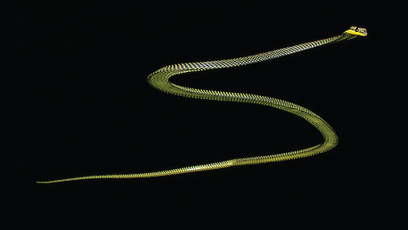

```{r setup, include=FALSE}
knitr::opts_chunk$set(echo = TRUE, fig.width = 5.5, fig.height=4.5)
```

The goal of this first workshop is to get you started working in R, and to introduce the most commonly-used data types, operations, and functions. Help is on the R tips page. The most useful pages for this exercise are Calculate, Data, and Graphs & Tables for producing frequency tables.

***

## Using the console
The command line in the R console is where you interact with R.

### Oversized calculator
At its most basic, the command line is a bloated calculator. The basic operations are

```{r eval = FALSE}
+  -  *  /
```

for add, subtract, multiply, divide. Familiar calculator functions also work on the command line. For example, to take the natural log of 2, enter

```{r eval = FALSE}
log(2)
```

<ol>

<li>Try the calculator out to get a feel for this basic application and the style of the output. Try log and a few other functions (see "Transform numbers" in the vector functions section of the R tips Calculate page).</li>

<li>R allows you to store or assign numbers and character strings to named variables called vectors, which are a type of "object" in R. For example, to assign the number "3" to a variable <code>x</code>, use

```{r eval = FALSE}
x <- 3
```

The assign symbol is a "less than" symbol followed by a dash, <code><-</code>, with no space between. Try assigning a single number to a named variable.</li>

<li>R can also assign character strings (enter using double quotes) to named variables. Try entering
```{r eval = FALSE}
z <- "Wake up Neo"  # single or double quotes needed
```
</li>

<li>At any time, enter <code>ls()</code> to see the names of all the objects in the working R environment. (You can save the environment for later use by entering <code>save.image()</code> or by saving when you exit R.)</li>

<li>Assign a single number to the variable <code>x</code> and another number to the variable <code>y</code>. Then watch what happens when you type an operation, such as

```{r eval = FALSE}
x * y
```

Finally, you can also store the result in a third variable.

```{r eval = FALSE}
z <- x * y
```

To print the contents of <code>z</code>, just enter the name on the command line, or enter <code>print(z)</code>.</li>
<li>The calculator will also give a TRUE or FALSE response to a logical operation. Try one or more variations of the following examples on the command line to see the outcome.

```{r eval = FALSE}
2 + 2 == 4     # Note double "==" for logical "is equal to"
3 <= 2         # less than or equal to
"A" < "a"      # greater than
"Hi" != "hi"   # not equal to (i.e., R is case sensitive)
```

</li>
</ol>

<br>

### Vectors
Vectors in R are used to represent variables. R can assign sets of numbers or character strings to named variables using the <code>c()</code> command, for concatenate. (R treats a single number or character string as a vector too, having just one element.)

```{r eval = FALSE}
x <- c(1,2,333,65,45,-88)
```

<ol>
<li>Assign a set of 10 numbers to a variable <code>x</code>. Make sure it includes some positive and some negative numbers. To see the contents afterward, enter <code>x</code> on the command line, or enter <code>print(x)</code>. Is it really a vector? Enter <code>is.vector(x)</code> to confirm.</li>
<li>Use integers in square brackets to indicate subsets of vector <code>x</code>.

```{r eval = FALSE}
x[5]        # fifth element
```

Try this out. See also what happens when you enter vectors of indices,

```{r eval = FALSE}
x[1:3]      # 1:3 is a shortcut for c(1,2,3)
x[c(2,4,9)]
```

Print the 3rd and 6th elements of <code>x</code> with a single command.</li>
<li>Some functions of vectors yield integer results and so can be used as indices too. For example, enter the function

```{r eval = FALSE}
length(x)
```

Since the result is an integer, it is ok to use as follows,

```{r eval = FALSE}
x[length(x)]
```

The beauty of this construction is that it will always give the last element of a vector <code>x</code> no matter how many elements <code>x</code> contains.</li>
<li>Logical operations can also be used to generate indicators. First, enter the following command and compare with the contents of <code>x</code>,

```{r eval = FALSE}
x < 0
```

Now enter

```{r eval = FALSE}
x[x < 0]
```

Try this yourself: print all elements of <code>x</code> that are non-negative.

The <code>which</code> command will identify the elements corresponding to TRUE. For example, try the following and compare with your vector <code>x</code>.

```{r eval = FALSE}
which(x < 0)
```

</li>
<li>Indicators can be used to change individual elements of the vector <code>x</code>. For example, to change the fifth element of <code>x</code> to 0,

```{r eval = FALSE}
 x[5] <- 0
```

Try this yourself. Change the last value of your <code>x</code> vector to a different number. Change the 2nd, 6th, and 10th values of <code>x</code> all to 3 new numbers with a single command.</li>
<li>Missing values in R are indicated by <code>NA</code>. Try changing the 2nd value of <code>x</code> to a missing value. Print <code>x</code> to see the result.</li>
<li>R can be used as a calculator for arrays of numbers too. To see this, create a second numerical vector <code>y</code> of the same length as <code>x</code>. Now try out a few ordinary mathematical operations on the whole vectors of numbers,

```{r eval = FALSE}
z <- x * y
```


```{r eval = FALSE}
z <- y - 2 * x
```

Examine the results to see how R behaves. It executes the operation on the first elements of <code>x</code> and <code>y</code>, then on the corresponding second elements, and so on. Each result is stored in the corresponding element of <code>z</code>. Logical operations are the same,

```{r eval = FALSE}
z <- x <= y              # greater than or equal to
z <- x[abs(x) < abs(y)]  # absolute values
```

What does R do if the two vectors are not the same length? The answer is that the elements in the shorter vector are "recycled", starting from the beginning. This is basically what R does when you multiply a vector by a single number. The single number is recycled, and so is applied to each of the elements of <code>x</code> in turn.

```{r eval = FALSE}
z <- 2 * x
```

</li>
<li>Make a data frame called <code>mydata</code> from the two vectors, <code>x</code> and <code>y</code>. Consult the R tips Calculate and Data frame pages for help on how to do this. Print <code>mydata</code> on the screen to view the result. If all looks good, delete the vectors <code>x</code> and <code>y</code> from the R environment. They are now stored only in the data frame. Type <code>names(mydata)</code> to see the names of the stored variables.</li>
<li>Vector functions applied to data frames may give unexpected results -- data frames are not vectors. For example, <code>length(mydata)</code> won't give you the same answer as <code>length(x)</code> or <code>length(y)</code>. But you can still access each of the original vectors using <code>mydata\$x</code> and <code>mydata\$y</code>. Try printing one of them. All the usual vector functions and operations can be used on the variables in the data frame. We'll do more with data frames below.</li>
</ol>

***

## Vector of data: flying snakes


<small><br>Photo by J. Socha, https://www.sciencenews.org/article/how-flying-snakes-stay-aloft</small>

### Analyze data in a vector
Paradise tree snakes (<i>Chrysopelea paradisi</i>) leap into the air from trees, and by generating lift they glide downward and away rather than plummet. An airborn snake flattens its body everywhere except for the heart region. It forms a horizontal “S” shape and undulates from side to side. By orienting the head and anterior part of the body, a snake can change direction, reach a preferred landing site, and even chase aerial prey. To better understand lift and stability of glides, Socha (2002, Nature 418: 603-604) videotaped eight snakes leaping from a 10-m tower ([video here](https://www.youtube.com/watch?v=UX7z3F-R9qM)). One measurement taken was the rate of side-to-side undulation. Undulation rates of the eight snakes, measured in Hertz (cycles per second), were as follows:

```{r eval = FALSE}
0.9 1.4 1.2 1.2 1.3 2.0 1.4 1.6
```

We'll store these data in a vector (variable) and try out some useful vector functions in R (review the common vector functions section on the Calculate page of the R tips web pages).
<ol>
<li>Put the glide undulation data above into a named vector. Afterward, check the number of observations stored in the vector.</li>
<li>Apply the <code>hist</code> command to the vector and observe the result (a histogram). Examine the histogram and you will see that it counts two observations between 1.0 and 1.2. Are there any measurements in the data between these two numbers? What is going on? The default in R is to use right-closed, left-open intervals. To change to left-closed right-open, modify an option in the <code>hist</code> command as follows,

```{r eval = FALSE}
hist(myvector, right = FALSE)
```

We'll be doing more on graphs next week.</li>
<li>Hertz units measure undulations in cycles per second. The standard international unit of angular velocity, however, is radians per second. 1 Hertz is 2π radians per second. Transform the snake data so that it is in units of radians per second (note: <code>pi</code> is a programmed constant in R).</li>
<li>Using the transformed data hereafter, calculate the sample mean undulation rate WITHOUT using the function <code>mean()</code> (i.e., use other functions instead)*.</li>
<li>Ok, try the function <code>mean()</code> and compare your answer.</li>
<li>Calculate the sample standard deviation in undulation rate WITHOUT using the functions <code>sd()</code> or <code>var()</code>. Then calculate using <code>sd()</code> to compare your answer**.</li>
<li>Sort the observations using the <code>sort()</code> command.</li>
<li>Calculate the median undulation rate. When there are an even number of observations (as in the present case), the population median is most simply estimated as the average of the two middle measurements in the sample.</li>
<li>Calculate the standard error of the mean undulation rate. Remember, the standard error of the mean is calculated as the standard deviation of the data divided by the square root of sample size.</li>
</ol>
<small>* 8.63938. ** 2.035985</small>

<!--

<br>

### Answers
All lines below beginning with double hashes are R output
```{r eval = TRUE}
# Input the data:
x <- c(0.9, 1.4, 1.2, 1.2, 1.3, 2.0, 1.4, 1.6)

# Histogram
hist(x, right = FALSE, col = "firebrick", main = "")

# Convert hertz to radians/sec
z <- x * 2*pi
z

# Mean without using mean() function
sum(z)/length(z)

# Using mean()
mean(z)

# Standard deviation without sd() or var()
sqrt( sum( (z - mean(z))^2 )/( length(z) - 1) )

# Compare with output of sd()
sd(z)

# Median
median(z)

# SE
sd(z)/sqrt(length(z))
```
[//]: #  -->

<br>

### Missing data
Missing data in R are indicated by <code>NA</code>. Many functions for vectors, such as <code>sum</code> and <code>mean</code>, will return a value of <code>NA</code> if the data vector you used contained at least one missing value. Overcoming this usually involves modifying a function option to instruct R to ignore the offending points before doing the calculation. See the Calculate page of the R tips pages for help on how to do this.
<ol>
<li>Use the <code>c()</code> function to add a single new measurement to the snake vector created in the previous section (i.e., increase its length by one) but have the new observation be missing, as though the undulation rate measurement on a 9th snake was lost.</li>
<li>Check the length of this revised vector, according to R. The length should be 9, even though one of the elements of the vector is NA.</li>
<li>What is the sample mean of the measurements in the new vector, according to R? Use a method that does not involve you directly removing the offending point yourself.</li>
<li>Recalculate the standard error of the mean, again leaving in the missing value in the vector. Did you get the same answer as in the previous section? If not, what do you think went wrong? Take great care when there are missing values.</li>
<li>Calculate the standard error properly, using the vector of 9 elements (i.e., including the NA). Use a method that will work on any vector containing missing values.</li>
</ol>

<!--

<br>

### Answers
All lines below beginning with double hashes are R output
```{r eval = TRUE}
# Add a missing observation
z <- c(z, NA)

# mean() with NA in vector, use na.rm=TRUE argument
mean(z, na.rm = TRUE)

# Oops, the following is not correct! length() includes the missing case
n <- length(z)
sd(z, na.rm = TRUE)/sqrt(n)

# Fix by excluding any missing value
  # use: n <- length(z[!is.na(z)])
  # or: n <- length(na.omit(z))
n <- length(na.omit(z))
sd(z, na.rm = TRUE)/sqrt(n)
```
[//]: -->

***

## <i>Anolis</i> lizards in a data frame
Here we will read data on several variables from a comma-delimited (.csv) text file into a data frame, which is the usual way to bring data into R. The data are all the known species of <i>Anolis</i> lizards on Caribbean islands, the named clades to which they belong, and the islands on which they occur. A subset of the species is also classified into "ecomorphs" clusters according to their morphology and perching habitat. Each ecomorph is a phylogenetically heterogeneous group of species having high ecological and morphological similarity. The list was compiled by Jonathan Losos from various sources and are provided in the Afterword of his wonderful book (Losos 2009. <i>Lizards in an evolutionary tree</i>. University of California Press).
<ol>
<li>Download the file <a href="../data/anolis.csv">anolis.csv</a> (click file name to initiate download) and save in a convenient place.</li>
<li>Open a new script file to write and submit your commands (or cut and paste to the command window) for the remainder of this section.</li>
<li>Read the data from the file into a data frame (e.g., call it <code>mydata</code>) using the <code>read.csv</code> command. See the R tips "Data" tab for further help on this step. For this first attempt, include <u>none</u> of the recommended options for the <code>read.csv</code> command, so we can explore R's behavior. By default, <code>read.csv</code> will convert all columns with character data to factors. A factor is like a character variable except that its unique values represent "levels" that have names but also have a numerical interpretation.</li>
<li>Use the <code>str</code> command to obtain a compact summary of the contents of the data frame. Every variable shown should be a factor (the default for character data). Another way to check the type of a specific variable in the data frame is to use the <code>is.factor</code> command, e.g.,

```{r eval = FALSE}
is.factor(mydata$Island)   # returns TRUE or FALSE
```

Another useful command is <code>class</code>, which will tell you what data type your object is. Try it out on both <code>mydata$Island</code> and <code>mydata</code>.</li>
<li>Use the <code>head</code> command to inspect the variable names and the first few lines of the data frame. Every variable in this data set contains character strings. (Why, yes, there's a <code>tail</code> command too.)</li>
<!--
<li> To check all the data, use the <code>fix</code> command. This will open a spreadsheet that allows you to see the whole data frame. If needed, you can use the mouse to expand the width of the columns to view the data better. The data are sorted by island name. Notice that each species is listed only once, and that some species are found on more than one island. (Unfortunately, not all its islands are given for <i>A. sagrei</i> -- ignore that issue for now.) You can use the spreadsheet to edit specific values of the data from, but this is NOT recommended. Using <code>fix</code> can change some of the properties of the data frame in unintended ways! Instead, we will use the command line to change specific values of a data frame, where a record is kept of the change.</li>
-->
<li>Let's focus on the variable "Ecomorph", since it has a manageable number of categories. Since "Ecomorph" is a factor, it will have "levels" representing the different groups. Use the <code>levels</code> command to list them. Notice anything unexpected? One of the categories is an empty character string. A couple of the groups appear to be listed twice. But look more closely -- are they really duplicates?</li>
<li>Use the <code>table</code> function on the "Ecomorph" vector to see the frequency (number of species) belonging to each named group. See, for example, that one species belongs to the "Trunk-Crown " (trailing space) group rather than to the"Trunk-Crown" (no spaces). Use the <code>which()</code> command to identify the row with the typo.</li>
<li>Using assignment (<code><-</code>), fix the single typo. Use the <code>table</code> function afterward to check the effect of your change.</li>
<li>Weirdly, the now-eliminated category of "Trunk-Crown " (trailing space) is still present in the frequency table. This is because, even though no species belong to this category, the category remains a factor level! Confirm this using the <code>levels</code> function. This confusing behavior is one reason why I recommend you avoid reading character variables in as factors. The presence of factor levels with no members can wreak havoc when fitting models to data. One way to delete unused levels of a factor variables is with the <code>droplevels</code> command.

```{r eval = FALSE}
mydata$Ecomorph <- droplevels(mydata$Ecomorph)
```

Check that this solved the problem.</li>
<li>Re-read the data from the file into R. This time, use <code>read_csv()</code> from the <code>readr</code> package, or options of the <code>read.csv</code> function in base R to 1) keep character data as-is; 2) strip leading and trailing spaces from character string entries, minimizing typos; and 3) treat empty fields as missing rather than as words with no letters.</li>
<li>How will you ever remember such a list of options in future, when it comes time to reading your own data into R? The answer is: you don't have to. I couldn't possibly remember it myself. If you keep a script file when you analyze the data you can always go back and consult it, and copy it the next time you need it. Type <code>?read.csv</code> in the command line at any time to get a complete list of all the read options and their effects. Try it now. Those options can be handy when you need them.</li>
<li>Use <code>table</code> once more to tally up the numbers of species in each Ecomorph category. Is there an improvement from the previous attempts? Which is the commonest Ecomorph and which is the rarest?</li>
<li>What happened to the missing values? Use <code>table</code> but include the <code>useNA = "ifany"</code> option in your <code>table()</code> command to include a count of <code>NA</code> values in your output table (see the R tips pages on frequency tables to see examples of the use of this argument). In this data set, <code>NA</code> refers to lizard species that do not belong to a standard ecomorph category, so it is worthwhile to include them. Perhaps they should be given their own named group ("none"), which is less ambiguous than NA.</li>
<li>How many <i>Anolis</i> species inhabit Jamaica exclusively?*</li>
<li>What is the total number of <i>Anolis</i> species on Cuba?** This is not the same as the number occurring exclusively on Cuba --- a few species live there and also on other islands. Figure out an elegant way in R to count the number of species that occur on Cuba. Bonus points for the briefest command! [Hint: check the vector functions for character data on the R tips Calculate page.]</li>
<li>What is the tally of species belonging to each ecomorph on the four largest Caribbean islands: Jamaica, Hispaniola, Puerto Rico and Cuba?*** Try to figure out a solution before looking at one below. (The solution below works but is not very economical. Try to come up with a more elegant solution yourself.)</li>
<li>What is the most frequent ecomorph for species that do not occur on the four largest islands?***</li>
</ol>
<small>
* 6
** 63
*** Trunk-crown</small>

<!--

<br>

### Answers
All lines below beginning with double hashes are R output
```{r eval = TRUE}
# Load libraries you might need
# (I'm including warn.conflicts=FALSE just to shorten the output here)
library(dplyr, warn.conflicts = FALSE)
library(readr, warn.conflicts = FALSE)

# Read the data (this is a shortcut)
mydata <- read.csv(url("https://www.zoology.ubc.ca/~bio501/R/data/anolis.csv"))

# See variable types
str(mydata)

# dplyr command instead
glimpse(mydata)

is.factor(mydata$Island)

class(mydata$Island)

head(mydata)
tail(mydata)

# Frequency table of ecomorphs
table(mydata$Ecomorph)

# Typo present
which(mydata$Ecomorph == "Trunk-Crown ")

# Repair
mydata$Ecomorph[mydata$Ecomorph == "Trunk-Crown "] <- "Trunk-Crown"

# Make frequency table again
table(mydata$Ecomorph)

# Re-read data with options
mydata <- read.csv(url("https://www.zoology.ubc.ca/~bio501/R/data/anolis.csv"), 
            strip.white = TRUE, na.strings = c("NA",""), stringsAsFactors = FALSE)

# or use read_csv() function from readr package
mydata <- read_csv(url("https://www.zoology.ubc.ca/~bio501/R/data/anolis.csv"))

# Variable types
str(mydata) # or use dplyr command "glimpse(mydata)"

# Number of species in each Ecomorph category
table(mydata$Ecomorph)

# Same, but include a tally of missing values too
#   (missing here means the species doesn't fall into an ecomorph series)
table(mydata$Ecomorph, useNA = "ifany")

# How many Anolis species inhabit Jamaica exclusively?
  # use: length(mydata$Species[mydata$Island == "Jamaica"])
  # or: nrow(mydata[mydata$Island == "Jamaica",])
  # or: nrow(filter(mydata, Island == "Jamaica"))
length(mydata$Species[mydata$Island == "Jamaica"])

# Total number of Anolis species on Cuba
# Use "grep" to find the species whose islands of occurrence include Cuba
  # use: length(mydata$Species[grep("Cuba", mydata$Island)])
  # or: length(grep("Cuba", mydata$Island))
  # or: nrow(mydata[grep("Cuba", mydata$Island), ])
  # or: nrow(filter(mydata, grepl("Cuba", Island)))
length(mydata$Species[grep("Cuba", mydata$Island)])

# What is the tally of species belonging to each ecomorph 
#   on the four largest Caribbean islands:
# 	Jamaica, Hispaniola, Puerto Rico and Cuba?
# **Wrong way**: Tally ecomorphs on just the four big islands. This fails to
#   include big-island species that are also found on smaller islands.
z <- mydata[mydata$Island %in% c("Cuba", "Jamaica", "Hispaniola", "Puerto Rico"), ]
table(z$Island, z$Ecomorph)

# One solution is to create a new variable indicating species occurrence on big islands
mydata$bigIsland <- rep(NA, nrow(mydata)) # create the new variable
mydata$bigIsland[grep("Cuba", mydata$Island)] <- "Cuba"
mydata$bigIsland[grep("Jamaica", mydata$Island)] <- "Jamaica"
mydata$bigIsland[grep("Hispaniola", mydata$Island)] <- "Hispaniola"
mydata$bigIsland[grep("Puerto Rico", mydata$Island)] <- "Puerto Rico"

# Finally:
table(mydata$bigIsland, mydata$Ecomorph)

# What is the most frequent ecomorph of species that do not occur 
#   on the four largest islands?
# One way is to make a new data frame that excludes large-island species
mydata2 <- mydata[!(mydata$bigIsland %in% 
                c("Cuba", "Jamaica", "Hispaniola", "Puerto Rico")), ]
table(mydata2$Ecomorph) # Trunk-Crown is the most frequent
```
[//]: -->
