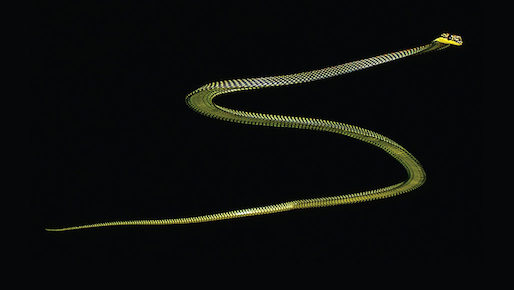

```{r setup, include=FALSE}
knitr::opts_chunk$set(echo = TRUE, fig.width = 5.5, fig.height=4.5)
```

The goal of this first workshop is to start working in R, or referesh your memory of it, and to introduce the most commonly-used data types, operations, and functions.

***

## Using the console
The command line in the R console is where you interact with R.

### Oversized calculator
At its most basic, the command line is a bloated calculator. The basic operations are

```{r eval = FALSE}
+  -  *  /
```

for add, subtract, multiply, divide. Familiar calculator functions also work on the command line. For example, to take the natural log of 2, enter the following. 

```{r eval = TRUE}
log(2)
```

1. Try the calculator out to get a feel for this basic application and the style of the output. Try ```log10()``` for log base 10, and ```sqrt()``` and ```abs()``` for square root and absolute value.

2. R allows you to store or assign numbers and character strings to named variables called vectors, which are a type of "object" in R. For example, to assign the number "3" to a variable <code>x</code>, use
<pre class="fakechunk">
x <- 3
</pre>
The assign symbol is a "less than" symbol followed by a dash, <code><-</code>, with no space between. Try assigning a single number to a named variable.

3. R can also assign character strings (enter using double quotes) to named variables. Try entering
<pre class="fakechunk">
z <- "Wake up Neo"  # single or double quotes needed
print(z)
</pre>

4. At any time, enter <code>ls()</code> to see the names of all the objects in the working R environment.

5. Assign a single number to the variable <code>x</code> and another number to the variable <code>y</code>. Then watch what happens when you type an operation, such as multiplication:
<pre class="fakechunk">
x * y
</pre>
Finally, you can also store the result in a third variable.
<pre class="fakechunk">
z <- x * y
</pre>
To print the contents of <code>z</code>, just enter the name on the command line, or enter <code>print(z)</code>.

6. The calculator will also give a TRUE or FALSE response to a logical operation. Try one or more variations of the following examples on the command line to see the outcome.
<pre class="fakechunk">
2 + 2 == 4     # Note double "==" for logical "is equal to"
3 <= 2         # less than or equal to
"A" < "a"      # greater than
"Hi" != "hi"   # not equal to (i.e., R is case sensitive)
</pre>

<br>

### Vectors

Vectors in R are used to represent variables with one or more elements. R can assign sets of numbers or character strings to named variables using the <code>c()</code> command, for concatenate. (R treats a single number or character string as a vector too, having just one element.)

```{r eval = FALSE}
x <- c(1, 2, 333, 65, 45, -88)
```

1. Assign a set of 10 numbers to a variable <code>x</code>. Make sure it includes some positive and some negative numbers. To see the contents afterward, enter <code>x</code> on the command line, or enter <code>print(x)</code>. Is it really a vector? Enter <code>is.vector(x)</code> to confirm.

```{r eval = FALSE, echo = FALSE}
x <- c(2, 6, 4, 88, 6, -5, -234, 3, 643, 0)
```

2. Use integers in square brackets to indicate subsets of vector <code>x</code>.
<pre class="fakechunk">
x[5]        # fifth element
</pre>
Try this out. See also what happens when you enter vectors of indices,
<pre class="fakechunk">
x[1:3]        # 1:3 is a shortcut for c(1,2,3)
x[c(2, 4, 9)] # need c() if more than one index
</pre>
Print the 3rd and 6th elements of <code>x</code> with a single command.

3. Some functions of vectors yield integer results and so can be used as indices too. For example, enter the function
<pre class="fakechunk">
length(x)
</pre>
Since the result is an integer, it is ok to use as follows
<pre class="fakechunk">
x[length(x)]
</pre>
The beauty of this construction is that it will always give the last element of a vector <code>x</code> no matter how many elements <code>x</code> contains.

4. Logical operations can also be used as indices. First, enter the following command and compare with the contents of <code>x</code>,
<pre class="fakechunk">
x < 0
</pre>
Now enter
<pre class="fakechunk">
x[x < 0]
</pre>
Try this yourself: show all elements of <code>x</code> that are non-negative.
The <code>which()</code> command will identify the elements corresponding to TRUE. For example, try the following and compare with your vector <code>x</code>.
<pre class="fakechunk">
which(x < 0)
</pre>

5. Indicators can be used to change individual elements of the vector <code>x</code>. For example, to change the fifth element of <code>x</code> to 0,
<pre class="fakechunk">
x[5] <- 0
</pre>
Try this. Change the last value of your <code>x</code> vector to a different number. Change the 2nd, 6th, and 10th values of <code>x</code> all to 3 new numbers with a single command.

6. Missing values in R are indicated by <code>NA</code>. Try changing the 2nd value of <code>x</code> to a missing value. Print <code>x</code> to see the result.

```{r eval = FALSE, echo = FALSE}
x[2] <- NA
x
```

7. R can be used as a calculator for whole vectors of numbers too. To see this, create a second numerical vector <code>y</code> of the same length as <code>x</code>. 
<!-- y <- round(runif(length(x), -100, 100), 0) --> 
Now try out a few ordinary mathematical operations on the whole vectors of numbers,
<pre class="fakechunk">
z <- x * y
print(z)
</pre>
<pre class="fakechunk">
z <- y - 2 * x
print(z)
</pre>
Examine the results to see how R behaves. It executes the operation on the first elements of <code>x</code> and <code>y</code>, then on the corresponding second elements, and so on. Each result is stored in the corresponding element of <code>z</code>. Logical operations are the same,
<pre class="fakechunk">
z <- x >= y              # greater than or equal to
print(z)
</pre>
<pre class="fakechunk">
z <- x[abs(x) < abs(y)]  # absolute values
print(z)
</pre>
What does R do if the two vectors are not the same length? The answer is that the elements in the shorter vector are "recycled", starting from the beginning. This is basically what R does when you multiply a vector by a single number. The single number is recycled, and so is applied to each of the elements of <code>x</code> in turn. Otherwise this is hard to control, however, and it is best to operate on vectors of the same length. 
<pre class="fakechunk">
z <- 2 * x
print(z)
</pre>

8. Use an operation to determine which elements of ```x``` are smaller than the corresponding element in ```y```. Optional: Can you make a new vector that contains only the smaller of the two numbers in ```x``` and ```y```, element by element?

9. Make a data frame called <code>mydata</code> from the two vectors, <code>x</code> and <code>y</code>. Consult the R tips Calculate and Data sets pages for help on how to do this. Print <code>mydata</code> on the screen to view the result. If all looks good, delete the vectors <code>x</code> and <code>y</code> from the R environment. They are now stored only in the data frame. Type <code>names(mydata)</code> to see the names of the stored variables.

10. Vector functions applied to data frames may give unexpected results -- data frames are not vectors. For example, <code>length(mydata)</code> won't give you the same answer as <code>length(x)</code> or <code>length(y)</code>. But you can still access each of the original vectors using <code>mydata\$x</code> and <code>mydata\$y</code>. Try printing one of them. All the usual vector functions and operations can be used on the variables in the data frame. We'll do more with data frames below.

***

## Vector of data: flying snakes


<small><br>Photo by J. Socha, https://www.sciencenews.org/article/how-flying-snakes-stay-aloft</small>

\

### Analyze data in a vector

Paradise tree snakes (<i>Chrysopelea paradisi</i>) leap into the air from trees, and by generating lift they glide downward and away rather than plummet. An airborn snake flattens its body everywhere except for the heart region. It forms a horizontal “S” shape and undulates from side to side. By orienting the head and anterior part of the body, a snake can change direction, reach a preferred landing site, and even chase aerial prey. To better understand lift and stability of glides, Socha (2002, Nature 418: 603-604) videotaped eight snakes leaping from a 10-m tower ([video here](https://www.youtube.com/watch?v=UX7z3F-R9qM)). One measurement taken was the rate of side-to-side undulation. Undulation rates of the eight snakes, measured in Hertz (cycles per second), were as follows:

```{r eval = FALSE}
0.9 1.4 1.2 1.2 1.3 2.0 1.4 1.6
```

We'll store these data in a vector (variable) and try out some useful vector functions in R (review the common vector functions section on the Calculate page of the R tips web pages).

1. Put the glide undulation data above into a named vector. Afterward, check the number of observations stored in the vector.

```{r eval = FALSE, echo = FALSE}
myvector <- c(0.9, 1.4, 1.2, 1.2, 1.3, 2.0, 1.4, 1.6)
```

2. Apply the <code>hist()</code> command to the vector and observe the result (a histogram). Examine the histogram and you will see that it counts two observations between 1.0 and 1.2. Are there any measurements in the data between these two numbers? What is going on? The default in R is to use right-closed, left-open intervals. To change to left-closed right-open, modify an option in the <code>hist()</code> command as follows,
<pre class="fakechunk">
hist(myvector, right = FALSE)
</pre>
We'll be doing more on graphs next week.

3. Hertz units measure undulations in cycles per second. The standard international unit of angular velocity, however, is radians per second. 1 Hertz is 2π radians per second. Transform the snake data so that it is in units of radians per second (note: <code>pi</code> is a programmed constant in R).

4. Using the transformed data hereafter, calculate the sample mean undulation rate WITHOUT using the function <code>mean()</code> (i.e., use other functions instead)*.

5. Ok, try the function <code>mean()</code> and compare your answer.

6. Calculate the sample standard deviation in undulation rate WITHOUT using the functions <code>sd()</code> or <code>var()</code>. Then calculate using <code>sd()</code> to compare your answer**.

7. Sort the observations using the <code>sort()</code> command.

8. Calculate the median undulation rate. When there is an even number of observations (as in the present case), the population median is most simply estimated as the average of the two middle measurements in the sample.

9. Calculate the standard error of the mean undulation rate. Remember, the standard error of the mean is calculated as the standard deviation of the data divided by the square root of sample size.

<small>* 8.63938. 
<br>** 2.035985</small>

[//]: <!--

<br>

### Answers
All lines below beginning with double hashes are R output

```{r eval = TRUE}
# 1. Input the data:
x <- c(0.9, 1.4, 1.2, 1.2, 1.3, 2.0, 1.4, 1.6)

# 2. Histogram
hist(x, right = FALSE, col = "firebrick", main = "")

# 3. Convert hertz to radians/sec
z <- x * 2*pi
z

# 4. Mean without using mean() function
sum(z)/length(z)

# 5. Using mean()
mean(z)

# 6. Standard deviation without sd() or var()
sqrt( sum( (z - mean(z))^2 )/( length(z) - 1) )

# 7. Compare with output of sd()
sd(z)

# 8. Median
median(z)

# 9. SE
sd(z)/sqrt(length(z))
```
[//]:  -->

<br>

### Missing data

Missing data in R are indicated by <code>NA</code>. Many functions for vectors, such as <code>sum()</code> and <code>mean()</code>, will return a value of <code>NA</code> if the data vector you used contained at least one missing value. Overcoming this usually involves modifying a function option to instruct R to ignore the offending points before doing the calculation. See the Calculate page of the R tips pages for help on how to do this.

1. Use the <code>c()</code> function to add a single new measurement to the snake vector created in the previous section (i.e., increase its length by one) but have the new observation be missing, as though the undulation rate measurement on a 9th snake was lost.

2. Check the length of this revised vector, according to R. The length should be 9, even though one of the elements of the vector is NA.

3. What is the sample mean of the measurements in the new vector, according to R? Use a method that does not involve you directly removing the offending point from the vector.

4. Recalculate the standard error of the mean, again leaving in the missing value in the vector. Did you get the same answer as in the previous section? If not, what do you think went wrong? Take great care when there are missing values.

5. Calculate the standard error properly, using the vector of 9 elements (i.e., the vector containing one NA). Use a method that will work on any vector containing missing values.

[//]: <!--

<br>

### Answers
All lines below beginning with double hashes are R output

```{r eval = TRUE}
# 1. Add a missing observation
z <- c(z, NA)

# 2. Length
length(z)

# 3. mean()
mean(z, na.rm = TRUE)

# 4. Oops, the following is not correct! length() includes the missing case
n <- length(z)
sd(z, na.rm = TRUE)/sqrt(n)

# 5. Fix by excluding any missing value
  # use: n <- length(z[!is.na(z)])
  # or: n <- length(na.omit(z))
n <- length(na.omit(z))
sd(z, na.rm = TRUE)/sqrt(n)
```
[//]: -->

***

## Lizards in a data frame

Here we will read data on several variables from a comma-delimited (.csv) text file into a data frame, which is the usual way to bring data into R. The data are all the known species of <i>Anolis</i> lizards on Caribbean islands, the named clades to which they belong, and the islands on which they occur. A subset of the species is also classified into "ecomorphs" clusters according to their morphology and perching habitat. Each ecomorph is a phylogenetically heterogeneous group of species having high ecological and morphological similarity. A measure of body size (snout-vent length, in mm) is included for a subset of species. The list was compiled by Jonathan Losos from various sources and are provided in the Afterword of his wonderful book (Losos 2009. <i>Lizards in an evolutionary tree</i>. University of California Press). The size data are from Mahler et al (2013) Science 341: 292-295.

1. Download the file <a href="../data/anolis.csv">anolis.csv</a> (click file name to initiate download) and save in a convenient place.

2. Open a new script file to write and submit your commands (or cut and paste to the command window) for the remainder of this section.

3. Read the data from the file into a data frame (e.g., call it <code>mydata</code>) using the <code>read.csv()</code> command. See the R tips Data tab for help on this step. For this first attempt, include no additional arguments or options for the <code>read.csv()</code> command other than the file name so we can explore R's behavior.

4. Use the <code>str()</code> command to obtain a compact summary of the contents of the data frame. Every variable shown should be a character which is the default for character data. Some functions will convert character data to factors, which is a special kind of character variable whose categories also have a numerical interpretation (useful when a specific order of categories is desired in a table or plot). Another useful command is <code>class()</code>, which will tell you what data type your object is. Try it out on a vector in your data frame, and again on the whole data frame.

5. Use the <code>head()</code> command to inspect the variable names and the first few rows of the data frame. Every variable in this data set contains character strings. (Why, yes, there's a <code>tail()</code> command too!)

6. Let's focus on the variable ```Ecomorph```, since it has a manageable number of categories. Use the <code>table()</code> function on the ```Ecomorph``` vector to see the frequency (number of rows, namely number of species) belonging to each named group. 

7. Notice anything odd about the table? One ecomorph category is blank and has 47 species (rows). Another ecomorph, the Trunk-Crown, seems to be present twice with different numbers of species. Same for Trunk-ground. Do you notice the cause of the problem?

8. The answer is that one species belongs to the "Trunk-Crown " (trailing space) category rather than to the "Trunk-Crown" (no spaces) category, caused by a typo in the data file. Identify the row with the typo.

9. Using assignment (<code><-</code>), fix the single typo. Make a new frequency table to check the effect of your change. Note that other Ecomorph categories still have the same problam.

10. Re-read the data from the file into R. This time, use options of the <code>read.csv()</code> function in base R to strip leading and trailing spaces from character string entries and treat empty fields as missing rather than as words with no letters.

11. How will you ever remember such a list of options in future, when it comes time to reading your own data into R? The answer is: you don't have to. I couldn't possibly remember it myself. If you keep a script file when you analyze the data you can always go back and consult it, and copy it the next time you need it. Type <code>?read.csv</code> in the command line at any time to get a complete list of all the read options and their effects. Try it now. Those options can be handy when you need them.

12. Tabulate again the numbers of species in each Ecomorph category. Is there an improvement from the previous attempts? Which is the commonest Ecomorph and which is the rarest?

13. What happened to the missing values? Use <code>table()</code> but include the <code>useNA = "ifany"</code> option in your command to include a count of <code>NA</code> values in your output table (see the R tips Display page on frequency tables to see examples of the use of this argument). In this data set, <code>NA</code> refers to lizard species that do not belong to a standard ecomorph category, so it is worthwhile to include them in the table. Perhaps they should be given their own named group ("none" or "unique"), which is less ambiguous than NA.

14. How many <i>Anolis</i> species inhabit Jamaica exclusively?*

15. What is the total number of <i>Anolis</i> species on Cuba?** This is not the same as the number occurring exclusively on Cuba --- a few species live there and also on other islands. Figure out a way in R to count the number of species that occur on Cuba. Bonus points for the briefest command! [Hint: check the vector functions for character data on the R tips Calculate page.]

16. What is the tally of species belonging to each ecomorph on the four largest Caribbean islands: Jamaica, Hispaniola, Puerto Rico and Cuba? Note: No species occurs on more than one large island, but some species that occur on a large island are also present on one or more smaller islands.*** 

17. What is the most frequent ecomorph for species that do not occur on the four largest islands?***

18. Save the cleaned up data frame in a new ```.csv``` file on your laptop. 

19. Body size data (snout-vent length, in mm) are included for a subset of species in the variable ```SVLength```. Using the available measurements, calculate the mean and standard deviation of body size of **Anolis** species.****

20. Which ecomorph is the largest on average, and which the smallest?***** To determine this, obtain the mean body size of the species in each ecomorph category. This can be accomplished in many ways, but try to use as few lines of code as possible. Consult the R tips Graphs and Tables page for hints.

<small>
* 6
<br>** 63
<br>*** Trunk-crown</small>
<br>**** 68.17814, 37.4241
<br>***** Largest: Crown-giant; Smallest: Grass-bush

[//]: <!--

<br>

### Answers
All lines below beginning with double hashes are R output

```{r eval = TRUE, message = FALSE}
# Load libraries you might need

library(dplyr)
library(readr)

# 3. Read the data (this is a shortcut)
mydata <- read.csv(url("https://www.zoology.ubc.ca/~bio501/R/data/anolis.csv"))

# 4. See variable types
str(mydata)

# dplyr command instead
glimpse(mydata)

class(mydata$Island)

class(mydata)

# 5. Head
head(mydata)
tail(mydata)

# 6. frequency table of ecomorphs
table(mydata$Ecomorph)

# 8. Typo present
which(mydata$Ecomorph == "Trunk-Crown ")

# 9. Repair
mydata$Ecomorph[mydata$Ecomorph == "Trunk-Crown "] <- "Trunk-Crown"

# Make frequency table again
table(mydata$Ecomorph)

# 10. Re-read data with options
mydata <- read.csv(url("https://www.zoology.ubc.ca/~bio501/R/data/anolis.csv"), 
            strip.white = TRUE, na.strings = c("NA",""), stringsAsFactors = FALSE)

# or use read_csv() function from readr package (not run)
# mydata <- read_csv(url("https://www.zoology.ubc.ca/~bio501/R/data/anolis.csv"))

# Variable types
str(mydata) # or use dplyr command "glimpse(mydata)"

# 12. Number of species in each Ecomorph category
table(mydata$Ecomorph)

# 13. Same, but include a tally of missing values too
#   (missing here means the species doesn't fall into an ecomorph series)

table(mydata$Ecomorph, useNA = "ifany")

# 14. How many Anolis species inhabit Jamaica exclusively?

length(mydata$Species[mydata$Island == "Jamaica"])

# or: nrow(mydata[mydata$Island == "Jamaica",])
# or: nrow(filter(mydata, Island == "Jamaica"))

# 15. Total number of Anolis species on Cuba
# Use "grep" to find the species whose islands of occurrence include Cuba
  # use: length(mydata$Species[grep("Cuba", mydata$Island)])
  # or: length(grep("Cuba", mydata$Island))
  # or: nrow(mydata[grep("Cuba", mydata$Island), ])
  # or: nrow(filter(mydata, grepl("Cuba", Island)))

length(mydata$Species[grep("Cuba", mydata$Island)])

# 16. What is the tally of species belonging to each ecomorph 
#     on the four largest Caribbean islands:
# 	  Jamaica, Hispaniola, Puerto Rico and Cuba?
# One solution is to create a new variable indicating species occurrence on big islands

mydata$bigIsland <- rep(NA, nrow(mydata)) # create the new variable
mydata$bigIsland[grep("Cuba", mydata$Island)] <- "Cuba"
mydata$bigIsland[grep("Jamaica", mydata$Island)] <- "Jamaica"
mydata$bigIsland[grep("Hispaniola", mydata$Island)] <- "Hispaniola"
mydata$bigIsland[grep("Puerto Rico", mydata$Island)] <- "Puerto Rico"

# Finally:
table(mydata$bigIsland, mydata$Ecomorph)

# A wrong way is tally ecomorphs on just the four big islands. This fails to
#   include big-island species that are also found on smaller islands.
# z <- mydata[mydata$Island %in% c("Cuba", "Jamaica", "Hispaniola", "Puerto Rico"), ]
# table(z$Island, z$Ecomorph)

# 17. What is the most frequent ecomorph of species that do not occur 
#     on the four largest islands?
# One way is to make a new data frame that excludes large-island species

mydata2 <- mydata[!(mydata$bigIsland %in% 
                c("Cuba", "Jamaica", "Hispaniola", "Puerto Rico")), ]
table(mydata2$Ecomorph) # Trunk-Crown is the most frequent

# 18. Write the cleaned up data frame to a .csv file
write.csv(mydata, "anolis_cleaned.csv", row.names = FALSE)

# 19. Mean and SD of body size (SVLength) of all species.

mean(mydata$SVLength, na.rm = TRUE)
sd(mydata$SVLength, na.rm = TRUE)

# or: use dplyr's summarize function
# summarize(mydata, meanSVL = mean(SVLength, na.rm=TRUE), sdSVL = sd(SVLength, na.rm=TRUE))

# 20. Mean and SD of body size by ecomorph category
# A simple approach is to use a for loop as follows:

for(i in unique(mydata$Ecomorph)) {
  cat(i, "\n")
  print( mean(mydata$SVLength[mydata$Ecomorph == i], na.rm=TRUE) )
  }

# But for bigger data sets a faster approach is to use a function with an implicit loop
# such as aggregate() or tapply() or summarize() from the dplyr package:

aggregate(SVLength ~ Ecomorph, data = mydata, FUN = mean, na.rm = TRUE)

tapply(mydata$SVLength, INDEX = mydata$Ecomorph, FUN = mean, na.rm = TRUE)

as.data.frame(summarize(group_by(mydata, Ecomorph), meanSVL = mean(SVLength, na.rm=TRUE)))

```
[//]: -->

*** 

## Random numbers

R is a great simulation tool because it can generate random numbers from a variety of statistical distributions. Here's a couple of examples of commands to generate random numbers.

Generate $n$ = 100 random numbers from a normal distribution with the following mean and sd (standard deviation).

```{r eval = FALSE}
rnorm(n = 100, mean = 10, sd = 2.5)
```

Generate 10 random numbers from a uniform distribution with the following lower and upper limits.

```{r eval = FALSE}
runif(n = 10, min = -1, max = 1)
```
\

1. Generate a vector of 20 random uniform numbers. 

2. Repeat the operation in (1). Compare the two sets of numbers. Probably they are different.

3. Computer-generated random numbers are only pseudo-random, however, generated by an algorithm called a random number generator. You can control the starting point using ```set.seed()```. Set the seed to a haphazard integer and repeat step (1). 

4. Set the seed again and to the same integer that you used in (3). Now repeat the operation in step 1. Compare the numbers you got with those in (3). The ```seed()``` command is a way to achieve reproducibility in simulation studies. \

\

### The sampling distribution of means

What would the distribution of sample means look like if we repeatedly took samples from the same population? We can use R to answer this question. Let's imagine a variable in hypothetical population having a uniform distribution, ie a "flat" distribution between a specified minimum and maximum value. 

5. Obtain a random sample of 20 numbers from a uniform distribution (you decide the minimum and maximum value). Repeat this operation 100 times and store the results into columns of a data frame or matrix. (One way to do this is to generate a single vector of 2000 random numbers and then use the ```matrix()``` command to reshape it into a matrix with 20 rows and 100 columns. You can convert to a data frame or leave it as a matrix.) Use the ```dim()``` command to confirm the dimensions of your data frame or matrix.

6. Generate a histogram of your 2000 numbers. Does it look uniform (flat)?

7. Obtain the sample mean of every column of numbers. Help on how to obtain row & column statistics is on the R tips page for Graphs and Tables. The same command works for matrices as for data frames.

8. Plot a histogram of the sample means obtained in (7). Describe the shape of the frequency distribution. How does it differ from the previous one you generated? This is the so-called sampling distribution of means.

9. What famous Theorem says that the distribution of sample means should approach a normal distribution as sample size increases, if the data themselves are sampled from a non-normal distribution? 

[//]: <!--

<br>

### Answers

```{r eval = TRUE}

# 1. Generate n = 20 random numbers from a uniform distribution with specified minimum and maximum value.
x <- runif(n = 20, min = -1, max = 1)
x

# 2. Repeat the operation in (1)
y <- runif(n = 20, min = -1, max = 1)
y

# 3. Set seed
set.seed(12345)
x <- runif(n = 20, min = -1, max = 1)
x

# 4. Repeat the operation in (3)
set.seed(12345)
x <- runif(n = 20, min = -1, max = 1)
x

# 5. Generate n = 2000 random numbers from a uniform distribution
x <- runif(n = 2000, min = -1, max = 1)
x1 <- matrix(x, ncol = 100)
dim(x1)

# 6. Histogram
hist(x, right = FALSE)

# 7. Column means
sampleMeans <- colMeans(x1)

# 8. Histogram of sample means - note bell shape
hist(sampleMeans, right = FALSE, breaks = 10)

# 9. What Theorem?
print("Central Limit Theorem")

```

[//]: -->
